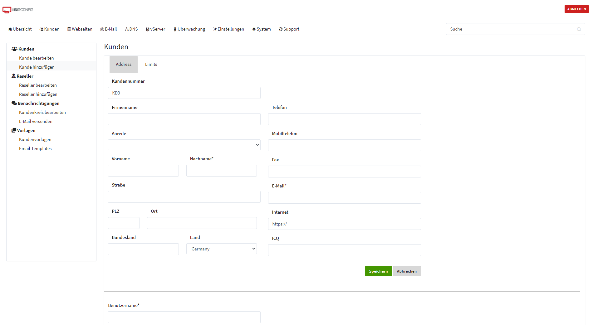
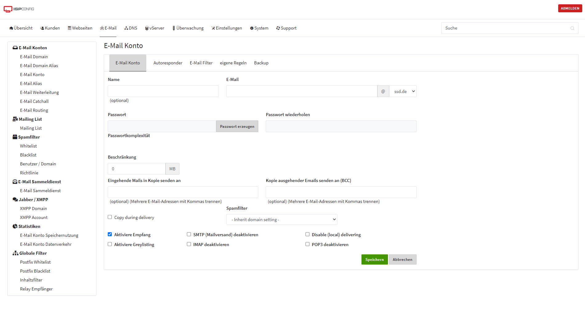
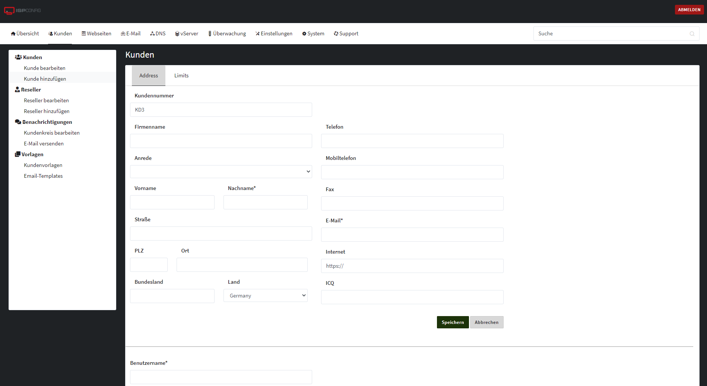
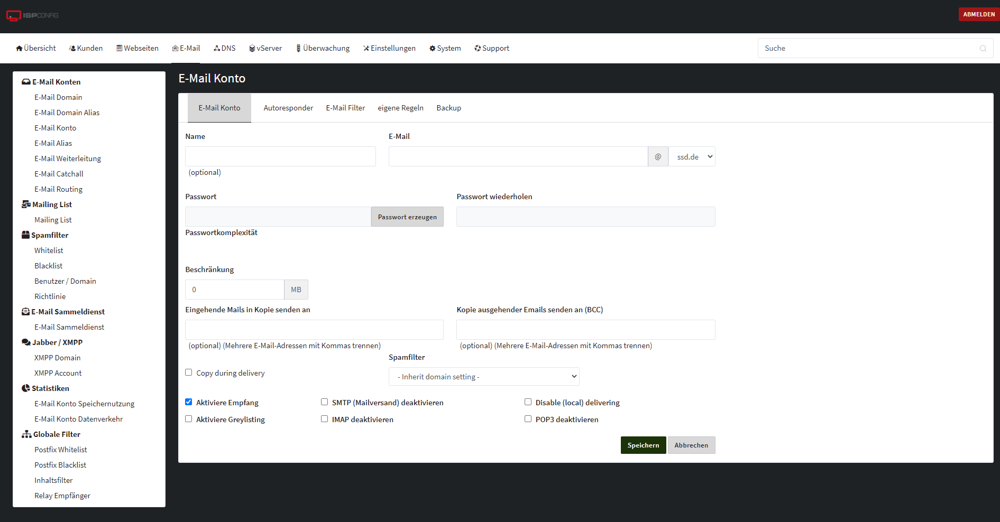
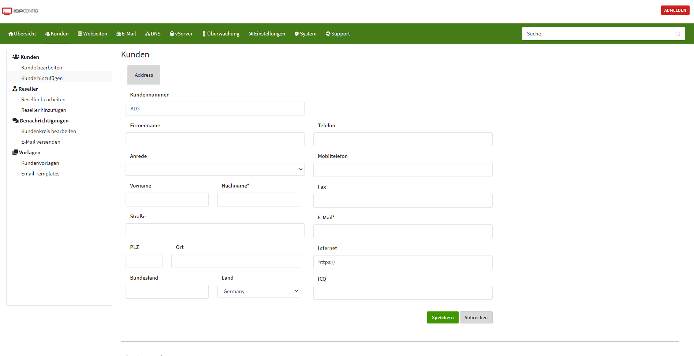
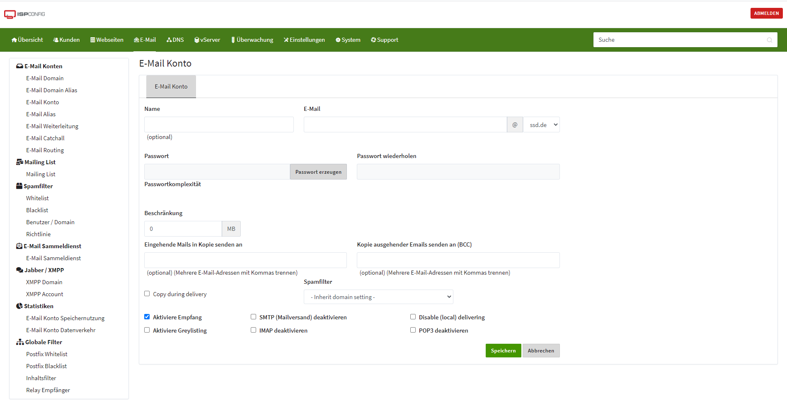

# Theme for ISP Config 3.2 based on Bootstrap 4.

Changes between the orgin and the firecups theme:

 - Based on Bootstrap v4.1.0
 - Used bootbox.js for error messages
 - Different Color Scheme: default, dark, blue, red, green
 - Complete redesign of all templates and forms

## Installation

Copy the template, the assets folder and the ispconfig_version file into a seperate folder under /var/ispconfig/theme/

Switch the theme in the user settings.

## Theme selection

Open the file templates/main.tpl and change the `<html lang="en">` agains `<html  lang='en' data-theme="COLOR-OPTION">`

You can use dark, blue, red, green as option. Without changes, the theme use the default color scheme.

## Screenshots

### Default Theme

### Dark Theme

### Green Theme

